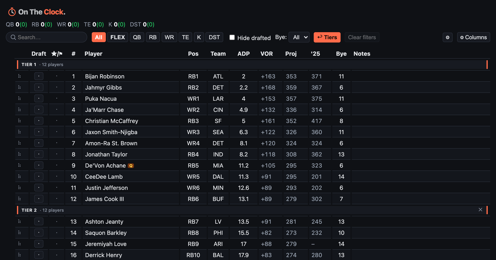

<div align="center">



# 🏈 On The Clock

**A draft-day cheat sheet that stays out of your way.**

Build tiers, mark targets, and track every pick on a single fast board — no logins, your data lives in your browser.

[](https://react.dev)
[](https://www.typescriptlang.org)
[](https://vite.dev)
[](https://vitest.dev)
[](https://vercel.com)

</div>

---

## Why it exists

Most draft tools want your email, bury the board behind ads, or lag when you're on the clock. On The Clock is the opposite: **open it, and the board is right there.** Every player, every stat, every tier — one screen, instant, offline-capable, and entirely yours. Nothing leaves your browser.

## Features

### 📋 Research board

- **Custom tiers** — draggable tier breaks, multiple tier lists per league
- **Target & avoid flags** — bullseye a player you want (◎), flag one to fade (⚑); every state is a distinct shape, not just a color
- **Editable ranks** — double-click to move a player and shift everyone else
- **Value Over Replacement (VOR)** — see who's actually worth their draft slot, not just their ADP
- **Column manager** — show/hide and drag-reorder columns (projections, last-season stats, VOR, bye, and more)
- **Smart search, injury badges, bye-week filter, CSV/JSON import & export**
- **Undo everything** — button or `⌘Z` / `Ctrl+Z`

### 📡 Multi-source ADP, refreshed live

One click blends **average draft position** from FantasyFootballCalculator, FantasyPros, Yahoo, and Sleeper into a single consensus number — so your board reflects where players are really going.

### ⏱️ Mock drafts

- A dedicated **draft room** with a snake or linear format, configurable scoring, team count, rounds, and draft slot
- **My Queue** — star players into an ordered queue that auto-drops each pick as it happens
- **Best-available picking** against bots, on a live 60-second clock
- **Two board views** — "The Wall" (teams × rounds grid) and "Locker Room"
- **TV mode** — cast the draft to a second window with a split-flap big board
- **"On the Clock" reveal moment** when it's your pick

### 🏟️ Multi-league

Separate scoring (PPR / half / standard, with TE-premium), roster settings, columns, and tier lists per league.

## Tech stack

| Layer             | Choice                                                                                       |
| ----------------- | -------------------------------------------------------------------------------------------- |
| **UI**            | React 19 + TypeScript                                                                        |
| **Build**         | Vite 8                                                                                       |
| **Drag & drop**   | `@dnd-kit` (tiers, columns, ranks)                                                           |
| **Tests**         | Vitest + Testing Library + jsdom — **561 cases across 80 files**                             |
| **Data fetching** | Vercel Edge functions (`/api`) + a Vite dev middleware so no separate local server is needed |
| **Fonts**         | Self-hosted Archivo, Barlow Condensed, IBM Plex Mono (works offline)                         |
| **Hosting**       | Vercel                                                                                       |

## Getting started

**Prerequisites:** Node 20+ and npm.

```bash
git clone <repo-url>
cd on-the-clock
npm install
npm run dev          # http://localhost:5173
```

That's it — the app ships with a seeded player board (`src/data/seed.json`), so it works fully offline with zero configuration.

### Scripts

| Command                           | What it does                                                     |
| --------------------------------- | ---------------------------------------------------------------- |
| `npm run dev`                     | Start the Vite dev server                                        |
| `npm run build`                   | Lint, type-check, and build for production                       |
| `npm run preview`                 | Preview the production build                                     |
| `npm run test`                    | Run the Vitest suite                                             |
| `npm run typecheck`               | `tsc --noEmit`                                                   |
| `npm run lint` / `lint:fix`       | ESLint                                                           |
| `npm run format` / `format:check` | Prettier                                                         |
| `npm run fetch-adp`               | Rebuild `src/data/seed.json` from a fresh multi-source ADP blend |
| `npm run yahoo-auth`              | One-time Yahoo OAuth to enable Yahoo as an ADP source            |

### Environment variables

All optional — the app runs without any of them.

| Variable                                                          | Purpose                                                                                                                           |
| ----------------------------------------------------------------- | --------------------------------------------------------------------------------------------------------------------------------- |
| `VITE_FORMSPREE_ENDPOINT`                                         | Suggestion box → Formspree. Unset → suggestions stash in localStorage.                                                            |
| `YAHOO_CLIENT_ID` / `YAHOO_CLIENT_SECRET` / `YAHOO_REFRESH_TOKEN` | Enable Yahoo as an ADP source. Populated by `npm run yahoo-auth`; set the same three in Vercel env for the hosted Refresh button. |

Copy `.env.local.example` → `.env.local` to get started.

## How the numbers work

- **Projections** (`src/lib/projection.ts`) — `scoreStatLine` scores a raw stat line with standard fantasy values (pass/rush/rec yards & TDs, interceptions, PPR / half / standard receptions, TE-premium), tuned to match ESPN projected totals within ~1%.
- **VOR** (`src/lib/vor.ts`) — computes league-wide starter slots (including FLEX and SUPERFLEX weighting), then subtracts each position's replacement-level baseline from a player's projection. A player's value is what they give you _over the guy you could stream_ — not their raw point total.

## Data pipeline

The board seed and live refresh pull from a weighted blend of public sources:

| Source                        | Provides                                                  |
| ----------------------------- | --------------------------------------------------------- |
| **Sleeper**                   | Projections, ADP, player-ID crosswalk                     |
| **FantasyCalc**               | Redraft trade values                                      |
| **FantasyPros**               | ADP                                                       |
| **Yahoo**                     | ADP (opt-in via OAuth)                                    |
| **ESPN**                      | ADP + player universe                                     |
| **FantasyFootballCalculator** | ADP                                                       |
| **DynastyProcess**            | ID crosswalk + draft pedigree                             |
| **nflverse**                  | Last-season advanced stats (target share, air yards, EPA) |

`npm run fetch-adp` bakes a fresh blend into `src/data/seed.json` at build time; the in-app **Refresh** button re-blends live ADP through the `/api/adp` Edge function. See [`scripts/adp/README.md`](scripts/adp/README.md) for the full source table, weights, and the yearly preseason checklist.

## Architecture

```
on-the-clock/
├── src/
│   ├── components/       # UI — board/, mock/, dev/
│   ├── lib/              # projection, vor, ranking, adpSources/, sources/, mock/
│   ├── state/            # useRankings (undoable reducer), useSources, hooks
│   ├── data/             # seed.json + team metadata
│   └── App.tsx
├── api/                  # Vercel Edge functions — adp.ts, sources.ts
├── scripts/              # ADP fetch pipeline, Yahoo OAuth, stat enrichment
├── public/               # favicon, OG image
└── docs/                 # design & redesign notes
```

**State** lives in a plain reducer wrapped in undo history (`src/state/useRankings.ts` → `withHistory`), with everything persisted to `localStorage` — no backend, no accounts.

## Deployment

Hosted on **Vercel**. The `/api` functions deploy as **Edge functions**; the exact same blend logic runs locally through a Vite middleware plugin, so `npm run dev` needs no separate API server. Set the Yahoo env vars in the Vercel project to power the hosted Refresh button.

## Privacy

No accounts, no tracking of your board. Your rankings, tiers, notes, and league settings never leave your browser's `localStorage`. Clear your storage and it's gone — it was only ever on your device.

---

<div align="center">
<sub>Built for people who take their fantasy draft a little too seriously. 🏆</sub>
</div>
